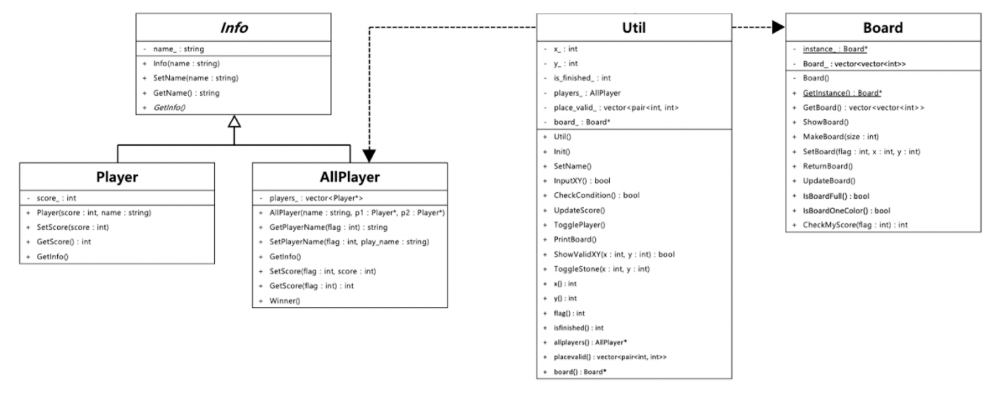
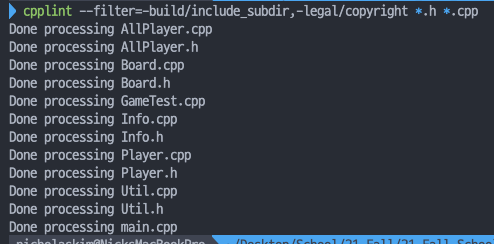
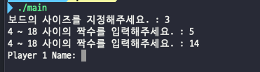
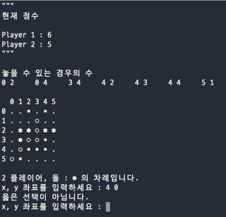
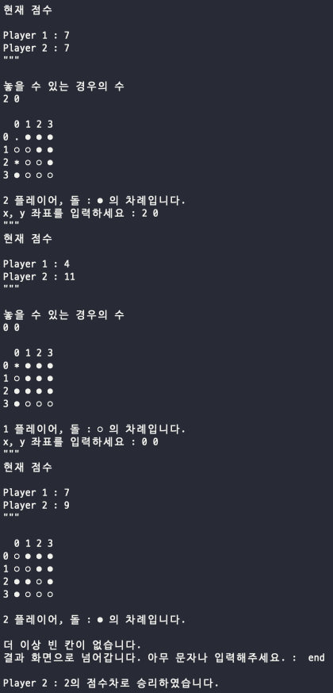
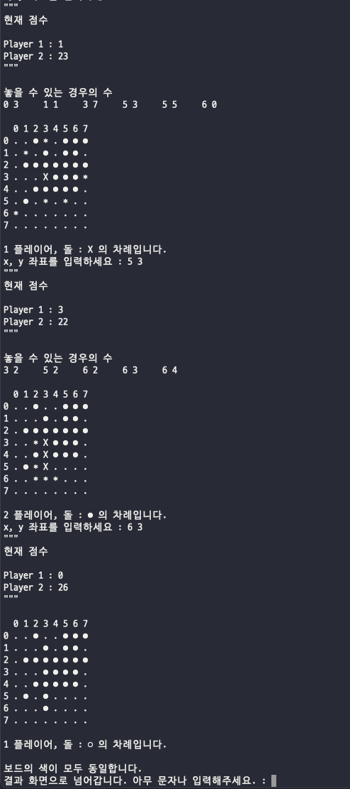
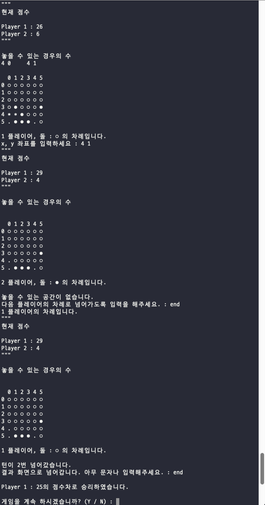

# 객체지향설계 00분반

### 팀원: 201802081 김현수, 201802093 박병휘, 201802151 장신형

# Othello

This project is made with C++ 17 in Object-Oriented Desing Class Team Project.

Due ~ 2021.12.14

<div align=center>

## Team info

| Name                                                                                           | Country           | GitHubLink                              |
| ---------------------------------------------------------------------------------------------- | :---------------- | --------------------------------------- |
| Hyunsoo Kim <br />   | Republic of Korea | [Github](https://github.com/dblepart99) |
| Shin Hyung Jang <br />  | Republic of Korea | [Github](https://github.com/LONGNEW)    |
| Bhung Hwi Park <br />      | Republic of Korea | [Github](https://github.com/BHwi)       |

# 데모 영상

[영상링크](https://youtu.be/-ghR2yTE2Qs)

### https://youtu.be/-ghR2yTE2Qs

---

| <b>목차 </b>                 |
| ---------------------------- |
| <b>0. 클래스 다이어그램 </b> |
| <b>0. Coding Convention </b> |
| <b>1. 구성 </b>              |
| <b>- 1-1. Board </b>         |
| <b>- 1-2. Util </b>          |
| <b>- 1-3. Info </b>          |
| <b>- 1-4. Player </b>        |
| <b>- 1-5. AllPlayer </b>     |
| <b>- 1-6. GameTest </b>      |
| <b>2. 안전성 </b>            |
| <b>3. 실행 시나리오 </b>     |

</div>

# 0. 클래스 다이어그램



# 0. Coding Convention



- cpplint를 적용하였습니다.

# 1. 구성

---

## 1-1. [Board](./Board.cpp) (게임 판을 관리하는 객체)

### Design pattern

- Singleton pattern
- 게임 판은 하나이기 때문에 관리는 오로지 생성된 유일한 객체로 관리되게 함이다.

### Function

```C++
Board() : 기본 생성자
static Board* GetInstance() : Singleton 객체 반환
vector< vector<int> > GetBoard() : getter for board_
void MakeBoard(int size) : size에 맞게 판을 만듦.
void SetBoard(int flag, int x, int y) : flag는 현재 플레이어가 누군지, x, y좌표에 돌 놓기
void ReturnBoard() : 업데이트 된 Board의 상태를 원상복구
void ShowBoard() : 게임 판을 출력해줌
bool IsBoardFull() : board_가 가득 찼는지 확인
bool IsBoardOneColor() : board_가 하나의 돌로 이루어졌는지 확인
int CheckMyScore(int flag) : flag_에 따라 보드에 flag + 1의 상태가 몇 개나 있는지 확인
```

### member field

#### private

```C++
static Board* instance_ : 싱글톤 객체
vector< vector<int> > board_ : board 2차원 vector
```

---

## 1-2. [Util](./Util.cpp) (게임의 전체적인 관리를 함.)

### Function

```C++
Util() : 기본 생성자, 돌을 둘 자리, 완료 여부, 플레이어, board를 초기 설정.
void InIt() : 모든 게임의 진행과정을 맡을 함수(main 이라 볼 수 있음)
void SetName() : 플레이어 두명의 이름 입력받는 함수
void MakeBoard() : Board 칸 입력받고, Board만드는 함수
bool InputXY() : 돌을 놓고 싶은 좌표 입력 받는 함수
bool CheckCondition() : 게임 진행 가능한지 확인하는 함수.
void UpdateScore() : 한 플레이어가 돌을 놓은 이후 모두의 점수를 업데이트 하는 함수
void TogglePlayer() : now_player_ 바꿔주기
void PrintBoard() : board 출력
bool ShowValidXY(int x, int y) : 둘 수 있는 돌의 좌표 알려주기, valid_ 횟수 세기
void ToggleStone(int x, int y) : 돌 뒤집기
ofstream* log() : 입력받은 값들을 메모장으로 남기기 위함.
int x() : getter for x_
int y() : getter for y_
int flag() : getter for flag_
int isfinished() : getter for is_finishied_
AllPlayer* allplayers() : getter for players_
vector< pair<int, int> > placevalid() : getter for place_valid_
Board* board() : getter for board_
```

### 주요 함수

```C++
void Util::Init() {
  // 선 플레이어 A로 가정.
  string start = "y";
  string flag_0 = "X";
  string flag_1 = "●";
  string use = "";
  /*
  start - 시작하는 변수 값을 y로 설정
  flag_0, flag_1 각각 돌 색깔 설정
  use 실제로 사용하는 돌의 모양
  */
  while (true) {
    this -> flag_ = 0;
    this -> x_ = 0;
    this -> y_ = 0;
    this -> is_finished_ = 0;
    /*
    멤버 필드 초기화
    flag_ = 0 을 통해 첫 시작 0번으로 지정
    x_, y_는 좌표 0, 0으로 초기화
    is_finished를 0으로 초기화하여 턴 체크
    */

    if ((start.compare("N") == 0) || (start.compare("n") == 0)) {
      cout << "게임을 종료 합니다." << endl;
      break;
    } else {
      // 재시작 할 경우 선수들 점수 다시 0으로 초기화
      this -> players_ -> SetScore(0, 0);
      this -> players_ -> SetScore(1, 0);
    }
    // 게임 내의 상황을 기록 하는 로그 txt파일을 염.
    ofstream fout;
    fout.open("z_log.txt");

    // 1. 게임시작 파트
    this -> MakeBoard();
    this -> SetName();
    // 보드 사이즈 로그에 기록.
    vector< vector<int> > add_board = board_ -> GetBoard();
    int board_size = add_board.size();
    fout << board_size << endl;

    // 플레이어 두 명의 이름 로그에 기록
    fout << this -> players_ -> GetPlayerName(0) << endl;
    fout << this -> players_ -> GetPlayerName(1) << endl;

    // 2. 플레이어 입력
    // 게임 진행은 끝나는 조건을 만날 때 까지 진행.
    // 플레이어의 색깔은 flag_로 판별.
    while (true) {
      // 턴이 변경되면 clear를 통해 지우기
      system("clear");
      // 플레이어의 돌을 표현하기 위한 비교.
      if (this -> flag_ == 0)
        use = flag_0;
      else
        use = flag_1;

      // 모든 사람 점수 출력
      this -> players_ -> GetInfo();

      // 게임 끝나는 조건 확인
      if (!(this -> CheckCondition()))
        break;

      // 본인이 둘 자리가 있는지 확인
      if (this -> place_valid_.size() == 0) {
        string temp;
        this -> PrintBoard();
        cout << this -> players_ -> GetPlayerName(flag_) << " 플레이어, 돌 : "
        << use << " 의 차례입니다." <<  endl;
        cout << endl;
        cout << "놓을 수 있는 공간이 없습니다." << endl;
        cout << "다음 플레이어의 차례로 넘어가도록 입력을 해주세요. : ";

        cin >> temp;
        this -> TogglePlayer();
        cout << this -> players_ -> GetPlayerName(flag_)
        << " 플레이어의 차례입니다." << endl;
        continue;
      }

      this -> PrintBoard();
      cout << this -> players_ -> GetPlayerName(flag_) << " 플레이어, 돌 : "
      << use << " 의 차례입니다." <<  endl;

      while (!this -> InputXY()) {
        cout << "옳은 선택이 아닙니다." << endl;
      }

      // ToggleStone함수로 판을 뒤집는다
      this -> ToggleStone(this -> x_, this -> y_);
      fout << this -> x_<< " " << this -> y_ << endl;
      //* 표시 된 공간을 다시 빈 공간으로 초기화
      this -> board_ -> ReturnBoard();


      // 점수 출력.
      this -> UpdateScore();
      this -> TogglePlayer();
    }

    // 누가 이겼는지 말해줘야 함. 점수 계산 함수????
    this -> players_ -> Winner();
    fout.close();

    cout << endl;
    cout << "게임을 계속 하시겠습니까? (Y / N) : ";
    cin >> start;

    while (!(start.compare("Y") == 0 || start.compare("N") == 0 ||
             start.compare("y") == 0 || start.compare("n") == 0)) {
      cout << "Y 또는 N을 입력해주세요." << endl;
      cout << "게임을 계속 하시겠습니까? (Y / N) : ";
      cin >> start;
    }
  }
  delete this -> players_;
}

bool Util::ShowValidXY(int x, int y) {
  // 현재 Player가 놓을 수 있는 위치를 계산.
  // 자기 자신의 돌은 flag + 1이 됨.

  // 현재 위치가 우선적으로 빈칸이어야 함.

  // flag를 통해 현재 플레이어가 누구인지 확인
  // 상, 하, 좌, 우, 상좌, 상우, 하좌, 하우 8방향으로
  // 뒤집을 수 있는 위치 존재하는 지 좌표로 비교에
  // 저장하고 나서 길이를 체크 해서 불가능 한지 판단.

  // 놓을 수 있는 공간을 3으로 업데이트
  int dx[8] = {0, 0, -1, 1, -1, -1, 1, 1};
  int dy[8] = {-1, 1, 0, 0, -1, 1, -1, 1};

  // ret의 경우 가능한 경우가 존재함을 의미.
  vector< vector<int> > add_board = board_ -> GetBoard();
  int board_size = add_board.size();
  int ret = 0;

  // 현재 위치가 빈칸인지 부터 확인.
  if (add_board[x][y] != 0) {
    return false;
  }

  // 상대 돌의 상태를 초기화
  int oppent = 0;
  int my_status = 0;
  if (flag_ == 1) {
    oppent = 1;
    my_status = 2;
  } else {
    oppent = 2;
    my_status = 1;
  }

  for (int idx = 0; idx < 8; idx++) {
    // possible을 통해 마지막에 위치하는 곳이 자기의 상태와 동일한지 판단
    //
    /*
    cnt는 상대방 돌의 갯수
    possible은 마지막에 체크한 돌로 포위가 가능한지 여부
    */
    int temp_x = x;
    int temp_y = y;
    int cnt = 0;
    int possible = 0;

    for (int i = 0; i < board_size; i++) {
      temp_x += dx[idx];
      temp_y += dy[idx];

      // 보드 내부의 위치가 아닌 경우 종료
      if (
        temp_x < 0 ||
        temp_x >= board_size ||
        temp_y < 0 ||
        temp_y >= board_size
        )
        break;

      // 나와 동일한 상대를 만나는 경우 possible 업데이트
      if (add_board[temp_x][temp_y] == my_status) {
        possible = 1;
        break;
      }

      // 상대방의 돌이 있는 경우에만 cnt++;
      // 그 외의 경우에는 이 지점에 돌을 놓을 수 없음.
      if (add_board[temp_x][temp_y] == oppent)
        cnt++;
      // 아직 자기 자신을 만나지 않았는데 빈칸인 경우
      if (add_board[temp_x][temp_y] == 3 || add_board[temp_x][temp_y] == 0)
        break;
    }

    if (possible && (cnt != 0)) {
      // 가능한 경우기 때문에
      // 3으로 업데이트 하는 방식
      board_ -> SetBoard(2, x, y);
      return true;
    }
  }
  return false;
}

void Util::ToggleStone(int x, int y) {
  // 상, 하, 좌, 우, 상좌, 상우, 하좌, 하우 8방향으로
  // 뒤집을 수 있는 위치인지 판단
  // 뒤집을 수 있는 경우 해당 방향에 존재하는 상대팀 돌을 뒤집기.
  int dx[8] = {0, 0, -1, 1, -1, -1, 1, 1};
  int dy[8] = {-1, 1, 0, 0, -1, 1, -1, 1};

  // ret의 경우 가능한 경우가 존재함을 의미.
  vector< vector<int> > add_board = board_ -> GetBoard();
  int board_size = add_board.size();

  // 상대 돌의 상태를 초기화
  int oppent = 0;
  int my_status = 0;
  if (flag_ == 1) {
    oppent = 1;
    my_status = 2;
  } else {
    oppent = 2;
    my_status = 1;
  }

  // 우선 직접 놓은 위치의 상태를 업데이트.
  board_ -> SetBoard(my_status - 1, x, y);

  for (int idx = 0; idx < 8; idx++) {
    // possible을 통해 마지막에 위치하는 곳이 자기의 상태와 동일한지 판단
    int temp_x = x;
    int temp_y = y;
    int cnt = 0;
    int possible = 0;

    for (int i = 0; i < board_size; i++) {
      temp_x += dx[idx];
      temp_y += dy[idx];

      if (
        temp_x < 0 ||
        temp_x >= board_size ||
        temp_y < 0 ||
        temp_y >= board_size
        )
        break;

      if (add_board[temp_x][temp_y] == my_status) {
        possible = 1;
        break;
      }

      if (add_board[temp_x][temp_y] == oppent)
        cnt++;
      if (add_board[temp_x][temp_y] == 0 || add_board[temp_x][temp_y] == 3)
        break;
    }

    if (possible && (cnt != 0)) {
      // 위의 반복문으로 값이 바껴서 업데이트 해야함.
      temp_x = x;
      temp_y = y;

      for (int i = 0; i < board_size; i++) {
        temp_x += dx[idx];
        temp_y += dy[idx];

        if (
          temp_x < 0 ||
          temp_x >= board_size ||
          temp_y < 0 ||
          temp_y >= board_size
          )
          break;

        if (add_board[temp_x][temp_y] == my_status)
          break;

        board_ -> SetBoard(my_status - 1, temp_x, temp_y);
      }
    }
  }
}

```

### member field

#### private

```C++
int x_, int y_ : 현재 입력 받은 돌 좌표
int flag_ : 플레이어 순서를 나타내는 변수
int is_finished_ : ShowValidXY 갯수 세기
AllPlayer players_ : AllPlayer 객체
vector<pair<int, int>> place_valid_ : 놓을 수 있는 공간들의 벡터
Board* board_ : 보드 객체를 가지고 있음.
static ofstream fout : 메모장에 남기기 위함.
```

---

## 1-3. [Info](./Info.cpp) (abstract class 추상 클래스)

### Feature

- abstract class

### Function

```C++
explicit Info(string name) : 이름을 초기화 하기 위한 생성자
void SetName(string name) : 현재 객체의 이름을 지정함.
string GetName() : 현재 객체의 이름을 가져감
virtual void GetInfo() = 0 : 각 플레이어의 정보 즉, 객체의 정보를 출력함.
```

### member field

#### private

```C++
string name_ : 플레이어 이름 변수
```

---

## 1-4. [Player](./Player.cpp) ([Info](./Info.cpp)를 상속하는 클래스)

### Design pattern

- class hierachy

### Function

```C++
Player(int score, string name) : 이름, 점수를 초기화하는 생성자
void SetScore(int score) : setter for score
int GetScore() : getter for score
void GetInfo() override : 객체의 정보를 출력
~Player() : 소멸자
```

### member field

#### private

```C++
int score_ : 플레이어 점수를 저장하는 변수
```

---

## 1-5. [AllPlayer](./AllPlayer.cpp) ([Info](./Info.cpp)를 상속하는 클래스)

### Design pattern

- class hierachy

### Function

```C++
AllPlayer(string name, Player* p1, Player* p2) : 이름, 플레이어 2명을 초기화하는 생성자.
string GetPlayerName(int flag) : flag에 따라 지정된 플레이어의 이름을 리턴
void SetPlayerName(int flag) : flag에 따라 지정된 플레이어의 이름을 업데이트
void GetInfo() override : 현재 플레이어의 점수상황을 출력
void SetScore(int flag, int score) : flag에 따라 지정된 플레이어의 점수를 지정
int GetScore(int flag) : flag에 따라 지정된 플레이어의 점수를 리턴.
void Winner() : 게임이 종료되고 두 플레이어 중 승자를 출력함
~AllPlayer() : players_를 삭제하는 소멸자
```

### member field

#### private

```C++
vector<Player*> players_ : 두 명의 플레이어를 저장하는 벡터
```

---

## 1-6. [GameTest](./GameTest.cpp) (gtest모듈을 활용한 test파일)

```C++
1. PlayerGetScoreTEST : Player 객체의 GetScore() 함수 확인.
2. PlayerSetScoreTEST : Player 객체의 SetScore() 함수 확인.
3. PlayerSetNameTEST : Player 객체의 SetName() 함수 확인.
4. PlayerGetNameTEST : Player 객체의 GetName() 함수 확인.
5. AllPlayerGetNameTEST : AllPlayer 객체의 GetPlayerName() 함수 확인.
6. AllPlayerSetNameTEST : AllPlayer 객체의 SetPlayerName() 함수 확인.
7. AllPlayerGetScoreTEST : AllPlayer 객체의 GetScore() 함수 확인.
8. AllPlayerSetScoreTEST : AllPlayer 객체의 SetScore() 함수 확인.
9. BoardTEST : Board객체의 MakeBoard() 함수 확인.
10. SetBoardTEST : Board객체의 SetBoard() 함수 확인.
11. ReturnBoardTEST : Board객체의 ReturnBoard() 함수 확인.
12. IsBoardFullFalseTEST : Board객체의 IsBoardFull() 함수 확인.
13. IsBoardFullTrueTEST : Board객체의 IsBoardFull() 함수 확인.
14. IsBoardOneColorTrueTEST : Board객체의 IsBoardOneColor() 함수 확인.
15. IsBoardOneColorFalseTEST : Board객체의 IsBoardOneColor() 함수 확인.
16. BoardCheckMyScoreTEST : Board객체의 CheckMyScore() 함수 확인.
17. UtilShowValidTEST1 : Util객체의 ShowValidXY() 함수 확인.
18. UtilShowValidTEST2 : Util객체의 ShowValidXY() 함수 확인.
19. UtilToggleStoneTEST2 : Util객체의 ToggleStone()함수 확인.
20. UtilUpdateScoreTEST : Util객체의 UpdateScore() 함수 확인.
21. TogglePlayerTEST : Util객체의 TogglePlayer() 함수 확인.
```

---

<br>

# 2. 안전성

### 1. board size에 대한 예외처리

#### 문제점

    1) board size가 4 이하일 경우 게임 진행 불가
    2) 홀수인 경우 시작 시 4개의 돌을 중앙에 놓을 수 없음
    3) 보드의 크기가 클수록 게임 진행에 문제가 발생

  

#### 해결

    1) 4이하의 입력에 대해 재입력 요구
    2) 짝수에 대한 입력을 요구
    3) 최대 크기는 20으로 제한

### 2. 사용자 입력에 대한 예외처리

#### 문제점

    1) int형 변수에 string 값이 저장될 경우 무한루프 발생
    2) 사용자가 돌을 놓지 못하는 곳에 돌을 둔 경우

  

#### 해결

    1) string 값으로 먼저 저장하여 입력값이 숫자인지 판단 후 저장
    2) 놓을 수 있는 곳(vector에 저장된 자표)으로 재입력 요구

### 3. 메모리 누수에 대한 예외처리

#### 문제점

    1) Player* p1, p2 객체와 같이 메모리 누수가 발생하는 변수 존재
    2) Util에서 할당된 객체는 AllPlayer만 존재

#### 해결

    1) AllPlayer의 소멸자에서 Player객체를 delete.
    2) 게임이 종료될 때(Init 종료) AllPlayer객체를 delete.

---

# 3. 실행 시나리오

#### 1. 게임 시작

- 보드의 사이즈 입력
- 플레이어 이름 입력

- 1. 보드 제작
- 2. 보드 초기 설정 하는 메소드

#### 2. 플레이어 입력

- 게임 진행 가능 판별
  - 1. 모든 돌이 동일한 색인지.
  - 2. 모든 공간이 채워졌는지
  - 3. 아무것도 하지 않은 턴이 2전 되었는지.
- 놓을 수 있는 공간 확인
- 현재 보드 상황

- 입력을 받음
  true

  - 1 놓으려는 좌표 입력
  - 2 놓을 수 있는 공간인지 확인

    true -> 공간에 돌을 둠
    false -> 다시 2 - true. 1로 이동

  false

  - 턴이 넘어간 횟수가 2번인지 확인

    true -> 게임 종료
    false -> 턴이 넘어간 횟수 업데이트, 플레이어 순서 넘김

- 돌을 뒤집은 후에 "3"으로 업데이트 되었던 값을 다시 0으로 보냄.

#### 3. 게임 종료

- 보드에 존재하는 돌의 개수 체크
- 누가 이겼는지 출력
- 게임을 더 할 것인지 물어봄

  true -> 1.로 돌아가 게임 시작
  false -> 프로그램 종료

#### 4. 게임이 끝나는 경우

[오델로 규칙](https://ko.wikipedia.org/wiki/%EC%98%A4%EB%8D%B8%EB%A1%9C)에 따르면 오델로가 끝나는 경우의 수는 총 세가지이다.

- 64개의 돌 모두가 판에 가득 찬 경우 (가장 일반적)

  

- 어느 한 쪽이 돌을 모두 뒤집은 경우

  

- 한 차례에 양 쪽 모두 서로 차례를 넘겨야 하는 경우

  
