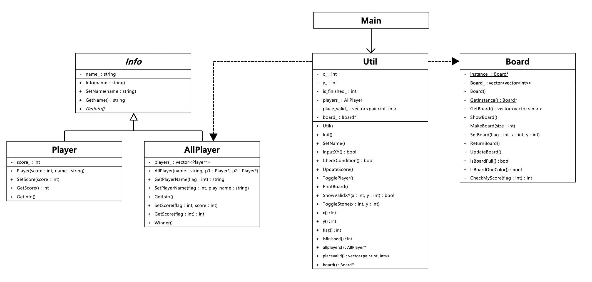

## Team: 현수야 병휘는 신형이가 싫대

| Name                                                                                           | Country           | Where to find us                        |
| ---------------------------------------------------------------------------------------------- | ----------------- | --------------------------------------- |
| Hyunsoo Kim <br />   | Republic of Korea | [Github](https://github.com/dblepart99) |
| Shin Hyung Jang <br />  | Republic of Korea | [Github](https://github.com/LONGNEW)    |
| Bhung Hwi Park <br />      | Republic of Korea | [Github](https://github.com/BHwi)       |

# 목차

## <a href="# 0. 클래스 다이어그램">0. 클래스 다이어그램</a>

## <a href="# 1. 구성">1. 구성</a>

- <a href="## 1-1. Board (Board.cpp 게임 판을 관리하는 객체)">1-1. Board</a>
-
- C.
- D.
- E.

## 2. 예외 처리

## 3. 실행 시나리오

# 0. 클래스 다이어그램


<br><br>

# 1. 구성

---

## 1-1. [Board](./Board.cpp) (게임 판을 관리하는 객체)

### Design pattern

- Singleton pattern
- 게임 판은 하나이기 때문에 관리는 오로지 생성된 유일한 객체로 관리되게 함이다.

### Function

```C++
Board() : 기본 생성자
static Board* GetInstance() : Singleton 객체 반환
vector< vector<int> > GetBoard() : getter for board_
void MakeBoard(int size) : size에 맞게 판을 만듦.
void SetBoard(int flag, int x, int y) : flag는 현재 플레이어가 누군지, x, y좌표에 돌 놓기
void ReturnBoard() : 업데이트 된 Board의 상태를 원상복구
void ShowBoard() : 게임 판을 출력해줌
bool IsBoardFull() : board_가 가득 찼는지 확인
bool IsBoardOneColor() : board_가 하나의 돌로 이루어졌는지 확인
int CheckMyScore(int flag) : flag_에 따라 보드에 flag + 1의 상태가 몇 개나 있는지 확인
```

### member field

#### private

```C++
static Board* instance_ : 싱글톤 객체
vector< vector<int> > board_ : board 2차원 vector
```

---

## 1-2. [Util](./Util.cpp) (게임의 전체적인 관리를 함.)

### Design pattern

- Singleton pattern
- 게임 관리자는 유일 객체를 통해서 하기 위함.

### Function

```C++
Util() : 기본 생성자, 돌을 둘 자리, 완료 여부, 플레이어, board를 초기 설정.
void InIt() : 모든 게임의 진행과정을 맡을 함수(main 이라 볼 수 있음)
void SetName() : 플레이어 두명의 이름 입력받는 함수
void MakeBoard() : Board 칸 입력받고, Board만드는 함수
bool InputXY() : 돌을 놓고 싶은 좌표 입력 받는 함수
bool CheckCondition() : 게임 진행 가능한지 확인하는 함수.
void UpdateScore() : 한 플레이어가 돌을 놓은 이후 모두의 점수를 업데이트 하는 함수
void TogglePlayer() : now_player_ 바꿔주기
void PrintBoard() : board 출력
bool ShowValidXY(int x, int y) : 둘 수 있는 돌의 좌표 알려주기, valid_ 횟수 세기
void ToggleStone(int x, int y) : 돌 뒤집기
ofstream* log() : 입력받은 값들을 메모장으로 남기기 위함.
int x() : getter for x_
int y() : getter for y_
int flag() : getter for flag_
int isfinished() : getter for is_finishied_
AllPlayer* allplayers() : getter for players_
vector< pair<int, int> > placevalid() : getter for place_valid_
Board* board() : getter for board_
```

### member field

#### private

```C++
int x_, int y_ : 현재 입력 받은 돌 좌표
int flag_ : 플레이어 순서를 나타내는 변수
int is_finished_ : ShowValidXY 갯수 세기
AllPlayer players_ : AllPlayer 객체
vector<pair<int, int>> place_valid_ : 놓을 수 있는 공간들의 벡터
Board* board_ : 보드 객체를 가지고 있음.
static ofstream fout : 메모장에 남기기 위함.
```

---

## 1-3. [Info](./Info.cpp) (abstract class 추상 클래스)

### Feature

- abstract class

### Function

```C++
explicit Info(string name) : 이름을 초기화 하기 위한 생성자
void SetName(string name) : 현재 객체의 이름을 지정함.
string GetName() : 현재 객체의 이름을 가져감
virtual void GetInfo() = 0 : 각 플레이어의 정보 즉, 객체의 정보를 출력함.
```

### member field

#### private

```C++
string name_ : 플레이어 이름 변수
```

---

## 1-4. [Player](./Player.cpp) ([Info](./Info.cpp)를 상속하는 클래스)

### Function

```C++
Player(int score, string name) : 이름, 점수를 초기화하는 생성자
void SetScore(int score) : setter for score
int GetScore() : getter for score
void GetInfo() override : 객체의 정보를 출력
~Player() : 소멸자
```

### member field

#### private

```C++
int score_ : 플레이어 점수를 저장하는 변수
```

---

## 1-5. [AllPlayer](./AllPlayer.cpp) ([Info](./Info.cpp)를 상속하는 클래스)

### Function

```C++
AllPlayer(string name, Player* p1, Player* p2) : 이름, 플레이어 2명을 초기화하는 생성자.
string GetPlayerName(int flag) : flag에 따라 지정된 플레이어의 이름을 리턴
void SetPlayerName(int flag) : flag에 따라 지정된 플레이어의 이름을 업데이트
void GetInfo() override : 현재 플레이어의 점수상황을 출력
void SetScore(int flag, int score) : flag에 따라 지정된 플레이어의 점수를 지정
int GetScore(int flag) : flag에 따라 지정된 플레이어의 점수를 리턴.
void Winner() : 게임이 종료되고 두 플레이어 중 승자를 출력함
~AllPlayer() : players_를 삭제하는 소멸자

```

### member field

#### private

```C++
vector<Player*> players_ : 두 명의 플레이어를 저장하는 벡터
```

---

## 1-6. [GameTest](./GameTest.cpp) (gtest모듈을 활용한 test파일)

1. PlayerGetScoreTEST : Player 객체의 GetScore() 함수 확인.
2. PlayerSetScoreTEST : Player 객체의 SetScore() 함수 확인.
3. PlayerSetNameTEST : Player 객체의 SetName() 함수 확인.
4. PlayerGetNameTEST : Player 객체의 GetName() 함수 확인.
5. AllPlayerGetNameTEST : AllPlayer 객체의 GetPlayerName() 함수 확인.
6. AllPlayerSetNameTEST : AllPlayer 객체의 SetPlayerName() 함수 확인.
7. AllPlayerGetScoreTEST : AllPlayer 객체의 GetScore() 함수 확인.
8. AllPlayerSetScoreTEST : AllPlayer 객체의 SetScore() 함수 확인.
9. BoardTEST : Board객체의 MakeBoard() 함수 확인.
10. SetBoardTEST : Board객체의 SetBoard() 함수 확인.
11. ReturnBoardTEST : Board객체의 ReturnBoard() 함수 확인.
12. IsBoardFullFalseTEST : Board객체의 IsBoardFull() 함수 확인.
13. IsBoardFullTrueTEST : Board객체의 IsBoardFull() 함수 확인.
14. IsBoardOneColorTrueTEST : Board객체의 IsBoardOneColor함수 확인.
15. IsBoardOneColorFalseTEST : Board객체의 IsBoardOneColor함수 확인.
16. BoardCheckMyScoreTEST : Board객체의 CheckMyScore 함수 확인.
17. UtilShowValidTEST1 : Util객체의 ShowValidXY 함수 확인.
18. UtilShowValidTEST2 : Util객체의 ShowValidXY 함수 확인.
19. UtilToggleStoneTEST2 : Util객체의 ToggleStone함수 확인.
20. UtilUpdateScoreTEST : Util객체의 UpdateScore 함수 확인.
21. TogglePlayerTEST : Util객체의 TogglePlayer()함수 확인.

---

<br>

# 2. 예외 처리

```
1. board size에 대한 예외처리

  문제점

    1) board size가 4 이하일 경우 게임 진행 불가
    2) 홀수인 경우 시작 시 4개의 돌을 중앙에 놓을 수 없음
    3) 보드의 크기가 클수록 게임 진행에 문제가 발생

  해결

    1) 4이하의 입력에 대해 재입력 요구
    2) 짝수에 대한 입력을 요구
    3) 최대 크기는 20으로 제한


2. 사용자 입력에 대한 예외처리

  문제점

    1) int형 변수에 string 값이 저장될 경우 무한루프 발생
    2) 사용자가 돌을 놓지 못하는 곳에 돌을 둔 경우

  해결

    1) string 값으로 먼저 저장하여 입력값이 숫자인지 판단 후 저장
    2) 놓을 수 있는 곳(vector에 저장된 자표)으로 재입력 요구

3. 메모리 누수에 대한 예외처리

  문제점

    1) Player* p1, p2 객체와 같이 메모리 누수가 발생하는 변수 존재
    2) Util에서 할당된 객체는 AllPlayer만 존재

  해결
    1) AllPlayer의 소멸자에서 Player객체를 delete.
    2) 게임이 종료될 때(Init 종료) AllPlayer객체를 delete.

```

<br><br>

# 3. 실행 시나리오

```
1. 게임 시작
  - 보드의 사이즈 입력
  - 플레이어 이름 입력

  - 1. 보드 제작
  - 2. 보드 초기 설정 하는 메소드

2. 플레이어 입력
  - 게임 진행 가능 판별
    - 1. 모든 돌이 동일한 색인지.
    - 2. 모든 공간이 채워졌는지
    - 3. 아무것도 하지 않은 턴이 2전 되었는지.
  - 놓을 수 있는 공간 확인
  - 현재 보드 상황

  - 입력을 받음
    true
      . 1 놓으려는 좌표 입력
      . 2 놓을 수 있는 공간인지 확인

        true -> 공간에 돌을 둠
        false -> 다시 2 - true. 1로 이동

    false
      - 턴이 넘어간 횟수가 2번인지 확인

      true -> 게임 종료
      false -> 턴이 넘어간 횟수 업데이트, 플레이어 순서 넘김

  - 돌을 뒤집은 후에 "3"으로 업데이트 되었던 값을 다시 0으로 보냄.

3. 게임 종료
  - 보드에 존재하는 돌의 개수 체크
  - 누가 이겼는지 출력
  - 게임을 더 할 것인지 물어봄

  true -> 1.로 돌아가 게임 시작
  false -> 프로그램 종료

```
